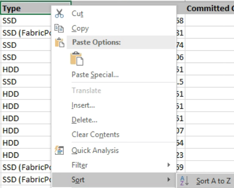

= 총 용량 대 사용 가능한 용량 차트를 보여 주는 보고서 생성
:allow-uri-read: 
:icons: font
:imagesdir: ../media/

[role="lead"]
보고서를 생성하여 Excel 차트 형식으로 저장 총계와 확정 용량을 분석할 수 있습니다.

== 시작하기 전에

* 애플리케이션 관리자 또는 스토리지 관리자 역할이 있어야 합니다.

== 이 작업에 대해

상태를 열려면 다음 단계를 수행합니다. 모든 집계 보기, Excel에서 보기 다운로드, 전체 및 커밋된 용량 차트 만들기, 사용자 지정된 Excel 파일 업로드 및 최종 보고서 예약

== 단계

. 왼쪽 탐색 창에서 * 스토리지 * > * 애그리게이트 * 를 클릭합니다.
. 보고서 * > * Excel 다운로드 * 를 선택합니다.
+
image::../media/download-excel-menu.png[Excel 메뉴 다운로드]

+
브라우저에 따라 * 확인 * 을 클릭하여 파일을 저장해야 할 수 있습니다.

. Excel에서 다운로드한 파일을 엽니다.
. 필요한 경우 * 편집 사용 * 을 클릭합니다.
. 를 누릅니다 `data` 시트에서 을 마우스 오른쪽 버튼으로 클릭합니다 `Type` 열을 선택하고 * Sort * > * Sort A to Z * 를 선택합니다.
+

+
이렇게 하면 다음과 같은 스토리지 유형별로 데이터가 배열됩니다.

+
** HDD
** 하이브리드
** SSD를 지원합니다
** SSD(FabricPool)

. 를 선택합니다 `Type`, `Total Data Capacity`, 및 `Available Data Capacity` 열.
. Insert * (삽입 *) 메뉴에서 A를 선택합니다 ``3-D column``차트.
+
차트가 에 나타납니다 `data` 시트.

+
image::../media/threed-column-01.png[3단 01]

. 차트를 마우스 오른쪽 단추로 클릭하고 * 차트 이동 * 을 선택합니다.
. 새 시트 * 를 선택하고 시트 이름을 * Total Storage Charts * 로 지정합니다.
+
[NOTE]
====
새 시트가 뒤에 나타나는지 확인합니다 `info` 및 `data` 시트.

====
. 차트 제목 이름 * 총 용량과 가용 용량 * 을 지정합니다.
. 차트를 선택할 때 사용할 수 있는 * Design * 및 * Format * 메뉴를 사용하여 차트의 모양을 사용자 지정할 수 있습니다.
. 원하는 대로 파일을 변경 내용과 함께 저장합니다. 파일 이름 또는 위치를 변경하지 마십시오.
+
image::../media/total-vs-available-capacity.png[총 용량과 가용 용량 비교]

. Unified Manager에서 * 보고서 * > * Excel 업로드 * 를 선택합니다.
+
[NOTE]
====
Excel 파일을 다운로드한 동일한 보기에 있는지 확인합니다.

====
. 수정한 Excel 파일을 선택합니다.
. 열기 * 를 클릭합니다.
. 제출 * 을 클릭합니다.
+
보고서 * > * Excel 업로드 * 메뉴 항목 옆에 확인 표시가 나타납니다.

+
image::../media/upload-excel.png[Excel 업로드]

. 예약된 보고서 * 를 클릭합니다.
. 새 보고서의 일정 특성을 정의할 수 있도록 별표 추가 * 를 클릭하여 * 보고서 일정 * 페이지에 새 행을 추가합니다.
+
[NOTE]
====
보고서의 * XLSX * 형식을 선택합니다.

====
. 보고서 일정 이름을 입력하고 다른 보고서 필드를 입력한 다음 확인 표시(image:../media/blue-check.gif[""])를 클릭합니다.
+
보고서가 즉시 테스트로 전송됩니다. 그런 다음 보고서가 생성되어 지정된 빈도를 사용하여 나열된 수신자에게 전자 메일로 전송됩니다.

== 작업을 마친 후

보고서에 표시된 결과를 기준으로 집계 부하의 균형을 맞출 수 있습니다.
